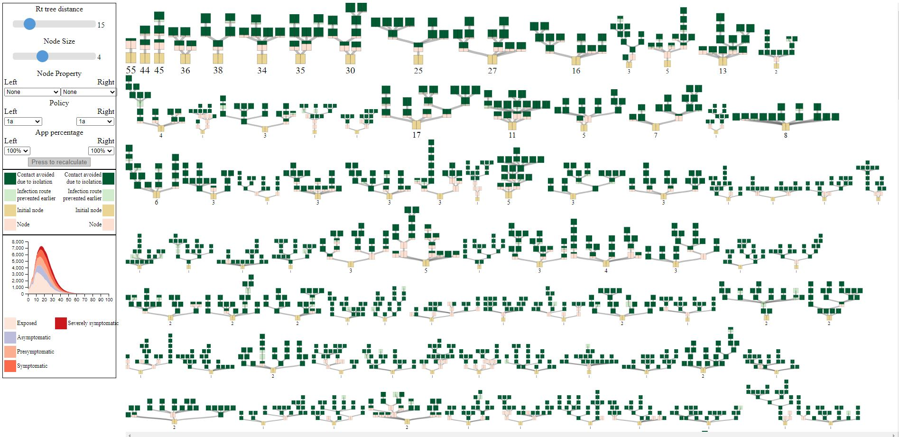

# A README template for new folders

## RepresentativeTreesViz

This prototype "clusters" the output of an infection map into trees of similar epidemic structure based on the R_t tree distance. A representative tree is chosen for the "clusters" and is used as a basis for visualization. A post-hoc policy simulation is performed to determine how different policies affect a given InfectionMap.

### Code Overivew and Technology

This project uses Java to preprocess the data with a CPLEX library to calculate the Tree Edit Distance and JUNIT for unit test.
The visualization using Javascript with d3 and requirejs.

To run the project, use the main method supplied in DataToJsonTree.java in InfectionTreeGenerator/ . Specify the inputfolder location and ensure that it has the following files:

infectionMap.txt
events.csv
contacts_pop_XXXX.csv
people_pop_XXXX.csv

These files are generated by the simulation output of https://github.com/ScottishCovidResponse/Contact-Tracing-Model

The resulting output files can be copied to ContactSimulationViz/data which will need to be hosted on a (local) webserver. A version (not always the latest) is available at http://cs.swansea.ac.uk/ContactViz/ContactSimulationViz/

### Example screenshots

Here is a screenshot from The prototype from 07/06/2021 where the resulting representative trees are visualized and a post-hoc policy on the trace of an infection map is visualized:

