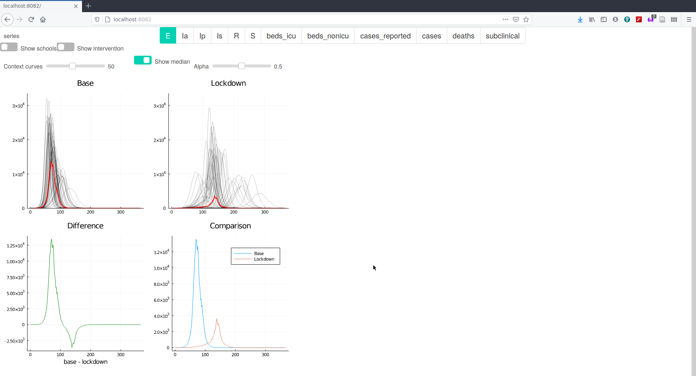

# Ensemble vis explorer

This is a Julia [Interact](https://github.com/JuliaGizmos/Interact.jl)-based webapp
for visualizing time series data from the ramp model outputs.

The code to load data, build the UI, and run the webserver is all in 
`analysis.jl`. 

## Interface and design decisions

The idea of the interface is to compare the results of various statistics 
with and without interventions. 

1. Comparisons are done by side by side plots, a difference view, and a single
   plot with the median curve from both conditions.
2. The distribution of results are shown as individual curves in the side by
   side plots. These lines use alpha blending to get a sense of the density
   of the distributions. In addition, the user can interactively change the
   number of lines shown. This gives a sense for how many distinctive curves
   there are.
3. School closings and the intervention blocks can be shown/hidden so they
   don't obscure other information.



## Code overview and technology

This project uses the [Julia](https://julialang.org) language and runs a 
small, local web server.

## Running 

At the bottom of `analysis.jl` is a command to start up a basic web server 
on port 8082. 

```
# Install and precompile all required packages
julia --project -e 'using Pkg; Pkg.instantiate()'

# run the server
julia --project analysis.jl
```

The first time you run the script it might take a while because Julia will be
compiling everything.

Once the server is up, go to http://localhost:8082 and the plots should be 
there!

## Contacts

Main contact people in this stream are:

Thomas Torsney-Weir, Swansea University

Hui Fang, Loughborough University

Rita Borgo, King's College London

Robert Laramee, University of Nottingham

Qiru Wang, University of Nottingham

Elif Firat, Swansea University

